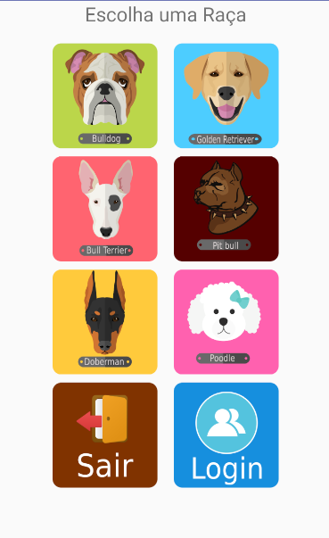
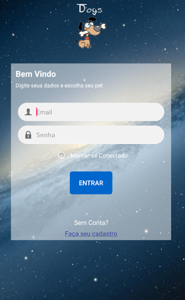
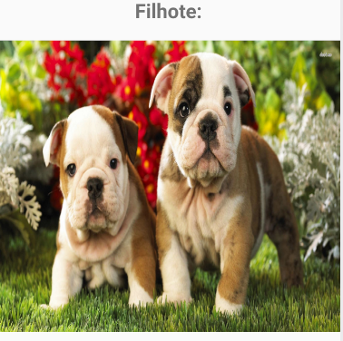

<h1 align="center">
    
    <br>
</h1>

<p align="center">
    
    
    
    
</p>

## What is inside?

Ferramentas do projeto:

- [Android](https://www.android.com)
- [Java](https://docs.oracle.com/en/java/)
- [SQLite](https://www.sqlite.org/index.html)

## Getting Started


```bash
# Execute no Android Studio
```
## Learn More

Aprenda mais:

- [Android and SQLlite](https://nextjs.org/docs) - Salvar dados usando o SQLite
- [Criando Splash Screen](https://www.alura.com.br/artigos/criando-uma-tela-de-abertura-no-android-splash-screen) - Splash Screen criando uma tela de abertura no Android
